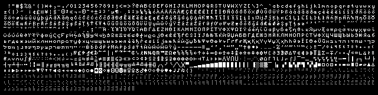
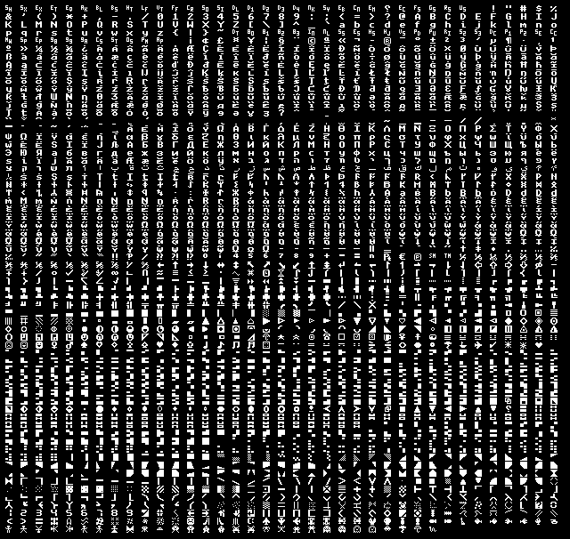

# FONTX2 fonts for embedded projects

This repository contains the public domain bitmap fonts to be used in embedded projects. The fonts are in [FONTX2](http://elm-chan.org/docs/dosv/fontx_e.html) format.

## X Window System



These are the classic public domain X Window System bitmap fonts. ISO 10646-1 source files were downloaded from [Dr Markus Kuhn's page](https://www.cl.cam.ac.uk/~mgk25/ucs-fonts.html) and 8-bit encoding variants were generated with the provided Makefile. See [X11](X11) for preview of all different variants.

```
$ mkdir ucs-fonts
$ cd ucs-fonts
$ wget https://www.cl.cam.ac.uk/~mgk25/download/ucs-fonts.tar.gz
$ wget https://www.cl.cam.ac.uk/~mgk25/download/ucs-fonts-asian.tar.gz
$ tar -xzvf *.tar.gz
$ cd submission
$ make all-bdfs
```

And then regenerate everything.

```
$ git clone git@github.com:tuupola/embedded-fonts.git
$ cd embedded-fonts
$ make
```

## Unscii



[Unscii](http://pelulamu.net/unscii/) is a set of bitmapped Unicode fonts based on classic system fonts. Unscii attempts to support character cell art well while also being suitable for terminal and programming use. See [misc/viznut/](misc/viznut/) for preview of all different variants.

```
$ cd fonts/misc/viznut
$ make
```

## FONTX2 tools

To generate all files by yourself install [FONTX2 tools](https://github.com/tuupola/fontx2_tools).

```
$ git clone git@github.com:tuupola/fontx2_tools.git
$ cd fontx2_tools
$ make && make install
```